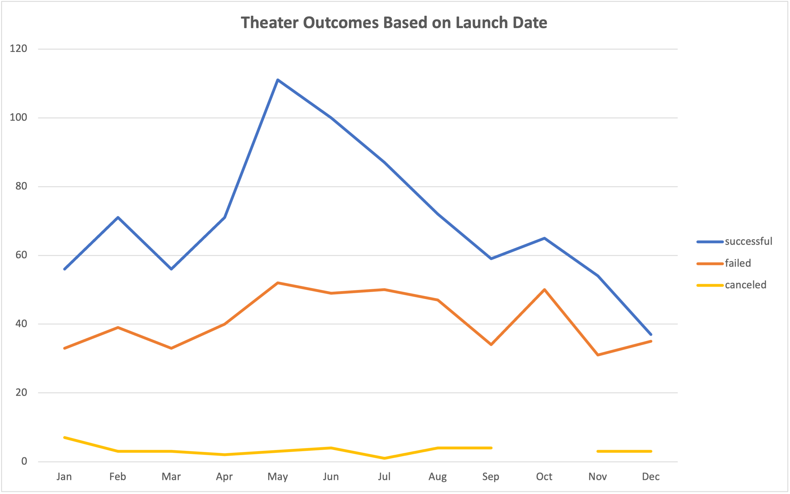
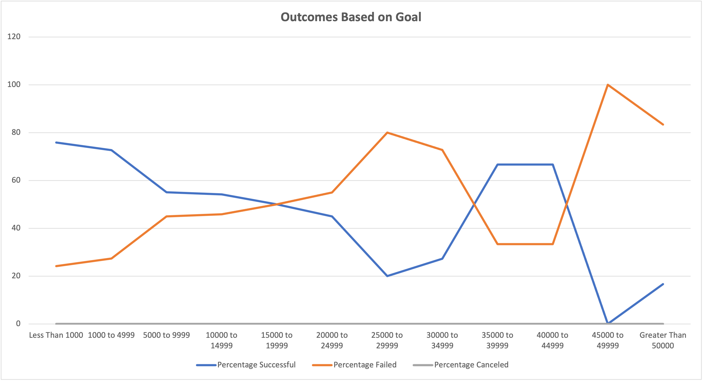

# Kickstarting with Excel

## Overview of Project

  A playwright has requested assistance in planning a crowdfunding campaign for a play they hope to produce. They would like to improve the play's chances of success by optimizing its launch date and funding goals. By examining a database of crowdfunding campaigns we were able to provide recommendations to the playwright that will bring their campaign into line with other similar campaigns that have demonstrated high statistical probabilities of success.

### Purpose

  The purpose of the project is to provide the playwright with specific targets for their launch date and funding goals in order to maximize the chances of the play's success. 

## Analysis and Challenges

  We analyzed a large database of crowdfunding campaigns to provide the playwright with optimal launch dates and funding goals. This database included campaigns spanning a wide range of categories, not limited to theater productions. This posed a challenge in that we only wanted to examine data from campaigns most similar to the playwright's. In order to provide the playwright with the targets most relevant to their project, we filtered the dataset to limit our analysis of launch dates to theater campaigns only. We further narrowed our analysis of funding goals by limiting it specifically to plays, excluding data from musicals and spaces which might have different ideal funding goals.
  
### Analysis of Outcomes Based on Launch Date

  To determine the optimal launch date for the playwright's campaign we first filtered the data to include only campaigns related to theater projects. Then we sorted the campaigns according to the month of their launch. We also sorted the outcomes into three categories: Successful, Failed, and Canceled. The following chart shows the relationship between a theater campaign's launch date and the number of those campaigns which were successful:
  
  
  
  The number of failed and canceled campaigns were fairly consistent from month to month, but a relatively large number of successful campaigns were launched in May as compared to other months. It is clear that a launch date in May will provide the best chances for a successful campaign.

### Analysis of Outcomes Based on Goals

  To determine the optimal funding goal for the playwright's campaign we filtered the data further to restrict it to campaigns for plays only. This provides the data for those projects which have the most similar funding needs to our playwright's. We segmented the funding goals of other campaigns in increments of $5000, then charted the percentage of successful, failed, and canceled campaigns according to those increments. The following chart demonstrates this relationship:
  
  
  
  Those campaigns whose funding goals were less than $1000 had the greatest success rates, while those above $15000 declined to less than 50% success rates. With the exception of campaigns with goals between $35000-$45000, campaigns greater than $15000 demonstrated success rates lower than 50%. Given the playwright's stated estimate of a $10000 goal, we strongly recommend they keep the goal below $15000, however, any further reduction below this target will only increase the chances of success.

### Challenges and Difficulties Encountered

  The central challenges in this project came about because of the large amount of data in the database which would not necessarily have a bearing on the outcome of our playwright's campaign. This required careful filtering to limit our analysis to only those campaigns which bore the most resemblance to that of our playwright. 
  The second greatest challenge was in grouping the data in such a way that it could demonstrate a discernable trend. For example, our decisions to analyze outcomes based on launch month rather than, say, launch day or week or year affected the presentation of the data. The same goes for the choice to group outcomes by funding goals in increments of $5000. A larger or smaller increment might have affected the usefulness of the resultant visualization.

## Results

- What are two conclusions you can draw about the Outcomes based on Launch Date?

  Our analysis of the Outcomes based on Launch Date shows that the month with the greatest number of successful campaigns launched is May. We can infer from this that a campaign launched in May will enjoy a greater likelihood of meeting its funding goal than the same campaign launched a different month.
  Secondly, our analysis shows that the month with the fewest number of successful campaigns launched is December. From this we can conclude that if a campaign is launched in December it will be more likely to struggle to meet its funding goals.

- What can you conclude about the Outcomes based on Goals?

  Our analysis of the Outcomes based on Goals shows that the percentage of successful campaigns was greatest when the funding goal was less than $1000, with decreasing odds of success as the funding goals increased. From this we can conclude that a lower funding goal correlates to a higher success rate, with the 50% success rate mark occurring at around a $15000 goal.

- What are some limitations of this dataset?

  The most significant limitation of this dataset is its limited scope. We are only able to analyze a few of the factors that affect a theater campaign's success, such as launch date and funding goal. Unfortunately, there are many more factors that impact the success of theater campaigns. For instance, the dataset could record the proposed venue at which the play will be performed. Will the play be performed at a summer festival, at a community theater, or in Carnegie Hall? Or the dataset could record data about the script itself, i.e., setting, style, plot, characters, etc. All of these will impact the backers' enthusiasm and hence the average donation.

- What are some other possible tables and/or graphs that we could create?

  Some other useful tables and graphs we could create might compare the Percentage of Funding against the Launch Date or Funding Goals. This might provide additional insights about the optimal launch date or goal targets over the more simplistic evaluation of success or failure alone. Likewise, analyzing the Total Funding Received based on launch date could give us a better idea of fluctuations in the amount of money available in a given month. Furthermore, we could filter the launch dates according to year and see how the launch date has impacted outcomes over time, and more importantly if there have been changes in recent years.
